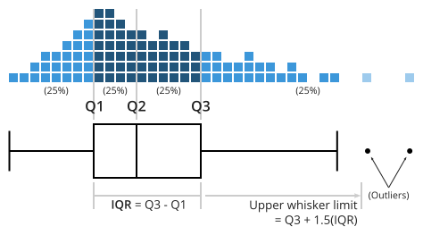

 

## Motivation

- You want to understand the market conditions for hotels in Vienna, using prices.
  - How should you start the analysis itself?
  - How to describe the data and present the key features?
  - How to explore the data and check whether it is clean enough for (further) analysis?

# Exploratory data analysis (EDA)
Once upon some data

## Exploratory data analysis (EDA) - describing variables

5 reasons to do EDA:

1. To check data cleaning (part of iterative process)
2. To guide subsequent analysis (for further analysis)
3. To give context of the results of subsequent analysis (for interpretation)
4. To ask additional questions (for specifying the (research) question)
5. Offer simple, but possibly important answers to questions.

All and all, EDA should help you identify some of the key features of the data and how they relate to each other.

## Key tasks: describe variables

::: columns

::: {.column width="50%"}

Look at key variables:

- what values they can take and
- how often they take each of those values.
- are there extreme values
:::

::: {.column width="50%"}

Describe what you see:

- Descriptive statistics: key features summarized
- to understand variables you work with
- to make comparisons
  
:::
:::

# Describing variables

## Frequency values

- The **frequency** or more precisely, **absolute frequency** or count, of a value of a variable is simply the number of observations with that particular value. 
- The **relative frequency** is the frequency expressed in relative, or percentage, terms: the proportion of observations with that particular value among all observations.
  - If missing values exist, Relative frequency could be relative to total observations or to non-missing observations.

- Can also use Probabilities: the relative likelihood of a value of a variable.
 
- How to? <u>`tab`</u>`ulate [variable]`, or better yet `fre [variable]` (SSC install)

## The distribution 

A key part of EDA is to look at (**empirical**) distribution of **most** important variables.

- All variables have a distribution. 
- The distribution determines the frequency of each value in the data.
- May be expressed in terms of absolute frequencies (number of observations) or relative frequencies (percent of observations).
- The distribution of a variable completely describes the variable as it occurs in the data.

## Histograms

Histogram reveals important properties of a distribution:

- As with tabulation, Histograms show the empirical distribution of a variable.
- They may allow you to see:
  - Number and location of modes: these are the peaks in the distribution (compared to neighbors).
- Shape of the distribution:
  - Center, tails, if its symmetric or not, Long [left or right tails], and extreme values.

- Extreme values: values that are very different from the rest. Extreme values are at the far end of the tails of histograms. (may even be signal of errors or missing)

## Extreme values

- Extreme values are substantially larger or smaller values for one or a handful of observations. Big departures from distribution.
- Need conscious decision.
  - Is this an error? (drop or replace)
  - Is this not an error, code for missing? (replace)
  - Is this not an error but not part of what we want to talk about? (drop?)
  - Is this an integral feature of the data? (keep)

## How to?

Histograms in `Stata` are created with the `histogram` command.

```stata
histogram [variable] [if in] [fweight], [bin(#) width(#) discrete] ///
          [density] [frequency] [fraction] 
```

- You can only create the histogram of one variable at a time. (unless combined)

- and you can determine how "fine" or "coarse" the histogram is. (A bit of art)

## Hotel Stars histograms

```{stata}
*| echo: false
*| output: false
set scheme white2
color_style tableau
use data_slides/hotels-vienna.dta, clear
label var stars "Stars Rating N Stars"
```

:::{.columns}

:::{.column width="50%"}
```{stata}
*| echo: true
*| code-fold: true
*| fig-cap: Absolute frequency

qui:histogram stars, d frequency ///
    scale(1.5) addlabels xlabel(1(.5)5)
```

:::

:::{.column width="50%"}
```{stata}
*| echo: true
*| code-fold: true
*| fig-cap: Relative frequency
qui:histogram stars, d percent ///
    scale(1.5) addlabels xlabel(1(.5)5)
```
:::
:::

## Hotel price histograms

:::{.columns}

:::{.column width="50%"}
```{stata}
*| echo: true
*| code-fold: true
*| fig-cap: Price Distribution  1$ bin
qui:histogram price, d  ///
    scale(1.5) width(1) 
```

:::

:::{.column width="50%"}
```{stata}
*| echo: true
*| code-fold: true
*| fig-cap: Price Distribution 30$ bin
qui:histogram price,  ///
    scale(1.5) width(30)
```
:::
:::

## Alternative Kdensity

- Perhaps one weakness of Histograms are the implicit binning. The density "jumps" from bin to bin.
- An alternative would be use smaller bins, requesting **jumps** to be smoother.
- This is done with Kernel Density Estimation (KDE) plots. `kdensity` in Stata.
- Two limitations: 
  - Not useful with discrete or limited variables
  - Also requires the use of bandwiths

## Kdensity for price

:::{.panel-tabset}

## Exmp1

```{stata}
*| echo: true
*| code-fold: true
*| fig-cap: Default Bandwidth
 *| kdensity price,   ///
    scale(1.5)  note("") bw(10)
```

## Exmp2

```{stata}
*| echo: true
*| code-fold: true
*| fig-cap: Bandwidth of 1
 kdensity price,   ///
    scale(1.5)  note("") bw(1)
```

## Exmp3

```{stata}
*| echo: true
*| code-fold: true
*| fig-cap: Bandwidth of 30
 kdensity price,   ///
    scale(1.5)  note("") bw(30)
```

:::

## EDA and cleaning - Vienna hotels   

1. Start with full data **N=428**
2. Tabulate key qualitative variables
3. Accommodation type - could be apartment, etc. Focus on hotels. N=264
4. Stars - focus on 3, 3.5, 4 stars. <3 not well covered, >4 vary a lot. N=218
5. Look at quantitative variables, focus on extreme values.
6. Start with price. p=1012 likely error drop. keep others N= 217
7. Distance: some hotels are far away. define cutoff. drop beyond 8km N=214
8. Check why hotels could be far away. Find variable `city_actual`. Tabulate. Realise few hotels are not in Vienna. Drop them. N=207
9. **the final cut**: Hotels, 3 to 4 stars, below 1000 euros, less than 8km from center, in Vienna actual **N=207**.

# Summary statistics:
Central tendency

## What are summary statistics?

- Summary statistics are numbers that summarize the distribution of a variable.
  - They provide numbers for the central tendency, spread, and shape.
- Summary statistics are used to describe the data and to make comparisons between different datasets.

## Summary statistics: Central Tendency

- The most used statistic is the mean:
  
$$\bar{x} = \frac{\sum x_i}{n}$$

where $x_i$ is the value of variable $x$ for observation $i$ in the dataset that has $n$ observations in total. Two key features:

1. Add a constant, the mean changes by the same constant.
2. Multiply by a constant, the mean changes by the same constant.

## The Expected value

- The expected value is the value that one can expect for a randomly chosen observation. It relates to the distribution of the population, not the sample
- The notation for the expected value is $E[x]$.
- For a quantitative variable, the expected value is the mean
- For a qualitative variable, means are not defined, but you can consider proportions.

## The median and other quantiles

- The median is another statistic of central tendency. It indicates the middle value of the distribution. Its a special case of quantiles.
  - Its main advantage with the mean is that it is less sensitive to extreme values. 
- **quantiles**: a quantile is the value that divides the observations in the dataset to two parts in specific proportions.
  
  $$Q_\tau(Y) \rightarrow \frac{1}{N}\sum I(y<Q_\tau) = \tau $$ 

- The median and 25th and 75th percentiles are the most common quantiles used in EDA.

## The mode

- Yet another measure of central tendency. 
- The mode is the value with the highest frequency in the data (the most common).
- If distributions have multimodal, you may be able to obtain multiple modes.
- Multiple modes are apart from each other, each standing out in its "neighborhood", but they may have different frequencies.

## Summary

- The mean, median and mode are different statistics for the central value of the distribution
- They try to provide you the most representative value of the distribution.
  - The mode is the most frequent value
  - The median is the middle value
  - The mean is the value that one can expect for a randomly chosen observation.

```stata
tabstat vars, stats(mean p50 )
summarize vars, detail
```

# Summary statistics: 
Spread and Shape 

## Spread of distributions

- Spread of distributions is often used in analysis.
  - It tells you how concentrated or dispersed the values of a variable are.
- The statistics that measure the spread of distributions are the range, inter-quantile ranges, the standard deviation and the variance.

## Ranges

There are three common measures of ranges:

- The **range** is the difference between the highest value (the maximum) and the lowest value (the minimum) of a variable.
- The **inter-quantile ranges** is the difference between two quantiles- the third quartile (the 75th percentile) and the first quartile (the 25th percentile). Can be used as an alternative to Standard deviation.
- The **90-10** percentile range gives the difference between the 90th percentile and the 10th percentile.

## Standard deviation

The most widely used measure of spread is the standard deviation, and Its square is the variance.

$$
\begin{aligned}
Var[x] &= \frac{\sum (x_i - \bar{x})^2}{n}=S^2_x \\
Std[x] &= \sqrt{\frac{\sum (x_i - \bar{x})^2}{n}}=S_x
\end{aligned}
$$

- The variance is less intuitive measure (Squared), but easier to work with (mean)
- The SD captures typical (not Mean) differences from the mean. 
- For the same mean, higher SD means more volatility. 

## Coefficient of variation

Unit Free alternative, Coefficient of variation: 

$$CV = \frac{Std[x]}{\bar{x}}
$$

- The coefficient of variation is the standard deviation divided by the mean. It reads, how much variation is there in the data relative to the mean.

## Other uses for SD: Standardized values

The SD is often used to re-calculate differences between values in order to express them as typical distance.

$$x_{standardized} = \frac{(x - \bar{x})}{Std[x]}
$$

- The standardized value has a mean of zero and a standard deviation of one.
- Represents the difference from the mean in units of standard deviation.
  - For example: a standardized value of one shows a value is one standard deviation larger than the mean; a standardized value of negative one shows a value is one standard deviation smaller than the mean

## Distribution Shape: Skewness

- A distribution is skewed if it isn't symmetric.
  - It may be skewed in two ways, having a long left tail or having a long right tail.
  - Example: hotel price distributions having a long right tail 
- Skewness and the presence of extreme values are related. 
- When extreme values are important for the analysis, skewness of distributions is important, too.

## Skewness measures

There are two common measures of skewness:

$$
Sk^1 = \frac{(\bar{x} - median(x))}{Std[x]} \text{ and } Sk^2 = \frac{\sum(x_i-\bar x)^3}{Std[x]^3}
$$

- When the distribution is symmetric its mean = median.
- Skewed to the right $\bar x > Q_{50}(x)$. 
- When a distribution is skewed with a long left tail the mean is smaller than the median
- To make this measure comparable, better to **standardize** the measure
- $SK^2$ is another Skewness measure. if Possitive, Skewed to the right, if negative, to the left.

## Stata Corner: How to?

Two basic options to get summary statistics in Stata:

- `summarize` command: provides basic statistics for all variables in the dataset. Include `detail` option for more statistics.
- `tabstat` command: provides more flexibility. You can choose which statistics to show and for which variables.
- use `estpost` to store the results and create well formatted tables.
- See [Stata Summary Statistics](https://friosavila.github.io/chatgpt/stata_08_04_2024/) for examples on how to use these commands.

## Visualizing summary statistics

- As mentioned before Histograms are a good way to visualize the distribution of a variable.
- However, if you would like to also visualize the summary statistics, you can use box plots
- The box plot is a visual representation of many quantiles and extreme values.

{fig-align=center}

## Box Plot

::: {.panel-tabset}

## Full Sample
```{stata}
*| echo: true
*| code-fold: true
*| fig-cap: "Box Plot: Viena prices"
*| fig-pos: center

use data_slides/hotels-vienna.dta, clear
qui:drop if price>800
graph box price, scale(1.4)  ///
  ytitle("Price in dollars (log Scale)") 
```

## By Stars

```{stata}
*| echo: true
*| code-fold: true
*| fig-cap: "Box Plot: Viena prices"
*| fig-pos: center

use data_slides/hotels-vienna.dta, clear
qui:drop if price>800
 graph box price if stars>1, scale(1.4) ///
  over(stars)  xsize(10) ysize(4) ///
  ytitle("Price in dollars (log Scale)")  
```


:::

# Distributions (in Theory)

## Theoretical distributions

- **Theoretical distributions** are distributions of variables with idealized properties.

- Theoretical distributions are fully captured by few parameters: these are statistics determine the whole distributions

- For example, the normal distribution is fully captured by two parameters: the **mean** and the **standard deviation**.
 
- They may not accomodate empirical data 

## Theoretical distributions

Theoretical distributions can be helpful:

- Have well-known properties!
- In real life, many variables surprisingly close to theoretical distributions.
- Will be useful when generalizing from data 

## The Normal distribution

:::{.columns}

:::{.column width="50%"}

- Histogram is bell-shaped
- Outcome (event), can take **any** value
- Distribution is captured by $\mu$ the mean and $\sigma$ the SD 
- Symmetric = median, mean (and mode) are the same.
:::

:::{.column width="50%"}

```{stata}
*| echo: false
*| fig-pos: center

twoway function y = normalden(x), range(-4 4) lw(1) 
```
:::

:::

## The log-normal distribution

:::{.columns}

:::{.column width="50%"}
- Asymmetrically distributed with long right tails.
  - Derived from a normally distributed variable (x), transform it: ($x^* = e^x$). The result is a distributed log-normal.
- **Always non-negative**
- Example distributions of income, or firm size.
:::

:::{.column width="50%"}

```{stata}
*| echo: false
*| fig-pos: center
clear 
set obs 10000
gen y = exp(rnormal()/2+2)
histogram y
```
:::

:::

## The Normality of Reality

- Quite suprisingly, many variables tend to follow normal distributions.
  - Especially when adding them up.
- May not be a good approximation when
  - There are reasons for non-symmetry (e.g. income)
  - If extreme values are "common"
- Variables are well approximated by the log-normal if they are the result of many things multiplied.

# Extra: Data Vizualization
Data Viz

## Data Visualization Essentials

::: columns

::: {.column width="50%"}
1. Purposeful Decision-Making
   - Avoid default settings
   - Define purpose, focus, and audience
   - Choose appropriate graph type

2. Key Considerations
   - Data type (qualitative, quantitative, time series)
   - Formatting (colors, fonts, sizes)
   - Essential elements: title, axis labels, legend

:::

::: {.column width="50%"}

3. One Graph, One Message
   - Tailor complexity to audience (general vs. specialist)
   - Be explicit about purpose and target audience

:::

:::

## Data Visualization Process

::: columns


::: {.column width="50%"}
1. Planning
   - Determine content and audience
   - Select graph type and elements
   - Seek help when needed (AI, online resources)

2. Execution
   - Include supporting elements for understanding
   - Ensure readability (use `scale()` function)

:::

::: {.column width="50%"}

3. Essential Components
   - Title (if not in the document)
   - Axis titles and labels (what's being measured)
   - Legend (group explanations)

4. Final Check
   - Verify all elements support the main message
   - Confirm graph is clear and accessible to the audience

:::
:::

See [DataViz](https://friosavila.github.io/chatgpt/stata_08_06_2024/) for a guide of how to create graphs in Stata.

## AI and data exploration/Viz

- AI is very good at describing the data, if you give it the tools (data)
- Pretty good with `python`, but less proficient with `Stata` for complex graphs.

- Still good to have someone to ask without judgement.
  
## Summary steps of EDA

1. First focus on the most important variables. Go back to look at others if
subsequent analysis suggests to.
2. For **qualitative** variables, list relative frequencies.
3. For **quantitative** variables, look at histograms. May decide for transformation, learn about key aspects of data.
4. Check for **extreme** values. Decide what to do with them.
5. Look at **summary** statistics. It may prompt actions, such as focusing on some part of the dataset.
6. Do further exploration if necessary (time series data, comparisons across groups of observations, correlations, etc.)

# **BREAK**

# Comparisons and Correlations

## Motivation

- Are larger companies better managed?

Answering this question may help in benchmarking management practices in a specific company, assessing the value of a company, or estimating the potential benefits of a merger between two companies.

To answer this question you downloaded data from the World Management Survey.

- How should you use the data to measure firm size and the quality of management?
- How should you assess whether larger companies are better managed?

# A story of two variables

## The $y$ and the $x$

-   Much of data analysis is built on comparing values of a $y$ variable against one, or more, $x$ variables.
-   Our job is to uncover the **patterns** of association:
    -   How observations with particular values of one variable ($x$) tend have particular values of the other variable ($y$).
-   The role of $y$ is different from the role of $x$.
    -   We are **interested** in $y$
    -   $X's$ are factors that you will use to analyze $y$.

## The $y$ and the $x$

-   This asymmetry comes from the goal of our analysis.
-   **Goal 1**: predicting the value of a $y$ variable with the help of other variables - many $x$ variables, such as $x_1$, $x_2$,...
    -   This is more useful when we do not know $y$ but know $x$.
-   **Goal 2**: learn about the effect of a causal variable $x$ on an outcome variable $y$.
-   Assuming everything else remains constant, What the value of $y$ would be if we could change $x$

# Conditioning and conditional distributions

## Comparison and conditioning

-   Similar ideas: Comparison $\rightarrow$ conditioning
-   We ***compare*** $y$, by values of $x$ $\rightarrow$ we ***condition*** y on x.
    -   $x$ (by the values of which we make comparisons) $\rightarrow$ conditioning variable.
    -   $y$ $\rightarrow$ outcome variable.
-   Compare salaries of workers ($y$) with low and high level of education ($x$)
    -   salary is the outcome
    -   education is the conditioning variable.

## Comparisons and conditional distributions

::::: columns
::: {.column width="50%"}
-   The **conditional distribution** of a variable is the distribution of the outcome variable given the conditioning variable: $f(y|X=x)$
-   Straightforward if $x$ is qualitative (simple if binary)
-   With quantitative variables, this definition is less intuitive.
:::

::: {.column width="50%"}
```{stata}
*| echo: true
*| fig-align: center
*| code-fold: true

qui: use "data_slides/hotels-vienna-london", clear
drop if price > 1000
set scheme white2
color_style tableau
two (kdensity price) ///
(kdensity price if city=="Vienna") ///
(kdensity price if city=="London"), ///
legend(order(1 "All" 2 "Vienna" 3 "London")) ///
xtitle("Hotel Prices") xsize(9) ysize(6)

```
:::
:::::

## Conditional statistic

If there is a Conditional distribution, there is a conditional statistic.

-   Conditional Stat is the Stat of a variable for each value of the conditioning variable.
    -   The conditional expectation of variable y for different values of variable $x$ is $E[y|x]$
-   This is a **function**: for a value of $x$, the conditional expectation is the expected value of $y$ for observations that have that $x$ value
-   It gives different values for different values of $x$.

## Case Study - Management quality and firm size

-   Question: Are larger Firms Better managed?
-   Data: World Management Survey
-   Answering this questions may help inform policy decisions.
-   How to measure firm size and quality of management?

## Case Study - Management quality and firm size

-   Interviews by CEO/senior managers, based on that a score is given.
    Average across different domains.

    -   tracking and reviewing performance or
    -   time horizon and breadth of targets, etc

-   Normalized - standardized score

-   Firm size: Consider three bins: small (100–199), medium (200–999), large (1000+)

```{stata}
*| echo: false
*| output: false

use "data_slides\wb-mx-management.dta", clear
keep if wave == 2013
keep if inrange(emp_firm,100,5000)
recode emp_firm (100/199=1 "Small") (200/999=2 "Medium") (1000/5000=3 "Large"), gen(firm_size)
```

## Case Study - Management quality and firm size

::::: columns
::: {.column width="50%"}
```{stata}
*| echo: false
*| output: asis
*| tbl-align: center 

qui: estpost tabstat management, by(firm_size) stat(mean median sd)  

esttab, cells("mean(fmt(2)) p50(fmt(2)) sd(fmt(2))") label ///
  nonumber nomtitle md 
```
:::

::: {.column width="50%"}
```{stata}
*| echo: false
*| output: asis
*| tbl-align: center 
qui: estpost tab lean1 firm_size

esttab , cell(colpct(fmt(2))) unstack nonumber collab(none) nomtitle noline md

```
:::
:::::

## Other options

-   Since $x$ is qualitative, and there are "enough" observations in each category, its also posible to plot the conditional distribution of $y$ for each value of $x$.

``` stata
two (histogram management ), by(firm_size) 
two (kdensity management ), by(firm_size) 
graph box management, over(firm_size) intensity(30) 
```

## Conditional and joint distributions

-   The previous Design assume $x$ to be discrete (Made Discrete). But what if not? Too many values!.
    -   Need to think about **joint** distributions
-   The joint distribution of two variables shows the probabilities (frequencies) of each value combination of the two variables.
-   A `scatter` plot is a two-dimensional graph with the values of each of the two variables measured on its two axes.
-   Works better when dataset is relatively small.
-   For larger samples, we can bin values, and use "bin scatter"
-   Bin scatter shows conditional means for bins we created

## Case Study - Management quality and firm size

::::: columns
::: {.column width="50%"}
```{stata}
*| echo: true
*| code-fold: true
*| fig-align: center

scatter management emp_firm, xtitle("Firm size") ytitle("Management score") ///
  legend(off) scale(1.5) 
```
:::

::: {.column width="50%"}
```{stata}
*| echo: true
*| code-fold: true
*| fig-align: center

sort emp_firm
qui:drop2 emp_firm_bin emp_mean_bin
xtile emp_firm_bin = _n, n(20)
bysort emp_firm_bin: egen emp_mean_bin=mean(emp_firm)
bysort emp_firm_bin:egen mean_mng=mean(management)

scatter mean_mng emp_mean_bin, xtitle("Firm size") ytitle("Management score") ///
  scale(1.5) legend(off) ylabel(1/5) ///
  note("Using 20 bins")
```
:::
:::::

::: notes
Some association shown.
Scatter not easy to read, bin-scatter shows positive (weak) association.
Notice Scale of y-axis.
Flat line for large firms
:::

## Other Options

::: panel-tabset
## Model Based Scatterplot

```{stata}
*| echo: true
*| code-fold: true
*| fig-align: center
two (scatter management emp_firm) ///
    (lfitci management emp_firm, fcolor(%30)), ///
    xtitle("Firm size") ytitle("Management score") ///
    legend(off) scale(1.5)

```

## Scale Change

```{stata}
*| echo: true
*| code-fold: true
*| fig-align: center
scatter management emp_firm, ///
  xtitle("Firm size") ytitle("Management score") ///
  xscale(log) scale(1.5) xlabel(100 250 500 1000 2000 3000 4000 5000)
```
:::

# Statistical dependence

Correlation, NOT causation

## Dependence and independence

-   Dependence of two variables $y$ and $x$ means that the conditional distributions of $y|x$ changes with $x$
    -   This is what we showed earlier
-   Independence means the opposite: the distribution of $y|x$ is the **same**, regardless of the value of $x$.
-   Dependence, may take many forms.
    -   $y$ may be more or less spread out for different $x$ values.
    -   the **mean** of $y$ is different for different $x$ values.

$$E[y|X=x_1] \neq E[y|X=x_2]$$

## Mean dependence

-   Mean-dependence: conditional expectation $E[y|x]$ varies with the value of $x$.
-   Two variables are positively **mean-dependent** if the average of two variables increase together.
-   Covariance and Correlation Coefficient are measures of mean **linear** dependence.
    -   They measure the same thing, but the correlation coefficient is a standardized version of the covariance.

## Covariance

The formula for the covariance between two variables $x$ and $y$ with n observations is:

$$Cov[x, y] = \frac{1}{n}\sum_i (x_i - \bar{x})(y_i - \bar{y})
$$

-   The Covariance is the [average]{.red} of the product of the deviations of the two variables from their respective means.
-   Positive covariance: positive deviations of $x$ go with positive deviations of $y$.
-   Negative covariance: positive deviations of $x$ go with negative deviations of $y$.

## The correlation coefficient

$$Corr[x, y] = \rho_{xy}= \frac{Cov[x, y]}{Std[x]Std[y]}$$

$$-1 \leq Corr[x, y] \leq 1$$

-   The correlation coefficient is the standardized version of the covariance.
-   It is bound to be between negative one and positive one.

## Dependence, mean-dependence, correlation

::: callout-note
If two variables are **independent**, they are also mean-independent, Thus $E[y|x] = E[y]$ of any value of x.
:::

::: incremental
-   Is this true the other way around?
    -   No, it is not.
-   Special cases:
    -   $\rho = 0$ but mean dependence (Sqrt of x)
    -   $\rho = 0$ and mean independence but different spread of $y$ (*`Heteroskedasticity`*)
:::

## Case Study - Management quality, firm size, Industry

| Industry               | Correlation | Observations |
|:-----------------------|------------:|-------------:|
| Auto                   |        0.50 |           26 |
| Chemicals              |        0.05 |           69 |
| Electronics            |        0.33 |           24 |
| Food, drinks, tobacco  |        0.05 |           34 |
| Materials, metals      |        0.32 |           50 |
| Textile, apparel       |        0.29 |           43 |
| Wood, furniture, paper |        0.28 |           29 |
| Other                  |        0.44 |           25 |
| All                    |        0.30 |          300 |

: Measures of management quality and their correlation with size by industry

# Latent Information

Sight beyond Sight

## *Measuring* a latent concept

-   Often a concept is hard, even impossible, to measure...directly
-   We often call them **Latent variables**: A variable that is not observed nor can be measured.
-   Examples:
    -   Quality of management at a firm - it is a concept that may be measured with a collection of variables, not a single one of them
    -   IQ - measured by a series of quiz-like questions.
    -   Employment satisfaction - measured by a series of questions about the job
-   How do you combine multiple observed variables

## Condensing information

-   Alternatives:

    -   Use one observed variable only: perhaps the one that is the best measure
    -   Use all variables individually
    -   Summarize them into a single variable
        -   Use a weighted average of all variables
        -   Principal component analysis (PCA)
        -   Latent variable analysis, ETC

## Using a single variable (or a few)

-   Using one measured variable and exclude the rest has the advantage of easy interpretation.
    -   The others could be used for robustness checks
-   It has the **disadvantage** of discarding potentially useful information.
-   But, can be often a sensible start

## Using an \[Weighted\] Average

-   Taking the average of all measured variables makes use of all information.

$$\bar{z_i} = \frac{1}{k}\sum_{j=1}^k z_i^j \text{ or }
\bar{z_i} = \frac{\sum_{j=1}^k w_j \times z_i^j}{\sum_{j=1}^k w_j}
$$

-   All should be measured in the same Scale. Simple and a natural interpretation


-   You can also use weights to give more importance to some variables than others.

-   Or can use sub-groups indices to create a composite index.

## Using an \[Weighted\] Average

-   **IMPORTANT**: All variables should be measured in the same scale.
    -   Otherwise, the average would be meaningless.
-   Thus, need bring it to common scale.
    -  **standardization**: Z-score
$$\tilde z_i^j = \frac{z_i^j - \bar{z}}{s_{z}}$$
    -  0-1 scale: Min-Max scaling
    $$\tilde z_i^j = = \frac{z_i^j - \min(z^j)}{\max(z^j) - \min(z^j)}$$

:::{.notes}

You may also want to consider using same units (dollars)
or use transformations (logs)

:::

## Let the 🖥️ decide

> Some times you may need to use other methods to combine variables. **Machine learning **methods! 

- Principal component analysis **(PCA)** is a method used for Data Reduction. Get weights to combine variables.
- The weights are constructed based on how correlated variables are. (high correlation, high weight)
- A Bit of black box method. But commonly used in practice: Wealth index, etc.

```Stata
pca var1 var2 var3 .. , components(#)
predict pca
``` 
- Can give odd results

## What to use?

-   Z-scores, and averages, are simple, easy to understand, -   Transparent
-   Typically marginally different to PCA (Try both)
-   But, Need to pay attention
    - Look at correlation signs, you may check it first (PCA is better here) (EDA. Do signs make sense?)
    -   Sensitive to extreme values (But can be fixed)

## Case Study - Management quality and firm size

-   The latent concept here is the overall quality of management, but we have 18 variables that measure different aspects of management.
-   Each were measured on a scale of 1 (worst practice) to 5 (best practice).
-   Lets use Simple Average and PCA to create a composite index.

## Stata Corner

```{stata}
*| echo: true
*| code-fold: false
*| output: false

use "data_slides\wb-mx-management.dta", clear
** Simple mean
egen mng_mean = rowmean(perf* talent* lean*)
** PCA
pca perf* talent* lean*, components(1)
predict mng_pca
label var mng_mean "Management Score (Mean)"
label var mng_pca "Management Score (PCA)"
```


## Scatter PCA vs Mean
```{stata}
*| echo: false
*| code-fold: true
*| fig-align: center

scatter mng_pca mng_mean , xtitle("Management Score (Mean)") ytitle("Management Score (PCA)") ///
  scale(1.5)
```

A Correlation analysis could also be useful to compare the two measures.

# Sources of Variation
Not all variables are created equal

:::{.notes}
We have talked that to make comparisons you need variation. But not all variation is the same. 
:::

## Comparison and variation in $x$

-   Variation in the **conditioning** variable is necessary to make comparisons.
  
-   Example: to uncover the effect of price changes on sales you need **many** observations with **different** price values.
-   Generalization: The more variation is there in the conditioning variable the better are the chances for comparison.
    -   Because the more likely you can capture "reality"

## Source of variation 

-   Not all variation is the same. you must ask:
    -   Why is there variation in the conditioning variable?
-   Depending on the source of variation, the interpretation of the comparison may be different.
    -   Good variation: You can make causal statements
    -   Bad variation: At best you can make correlation statements

## The Good: Experimental data

-   Say you have an intervention or treatment.
    -   Some people get the treatment, others do not.
-   In experimental data, there is controlled variation: a rule deciding treatment
-   This is the best source of variation for causal analysis.
    -   Differences in the outcome variable will be due to the treatment variable only.
-   Example: drug trial
    -   Medical experiment: some patients receive the drug while others receive a placebo (treatment/control)
    -   Outcome is recovery from the illness or not
    

## The Bad? Observational data

-   Most data used in business, economics and policy analysis are observational. 
-   In observational data, **no variable** is fully controlled.
-   They are the results of decisions, choices, interactions, expectations, etc. (sources of variation)
    - Some of this could be random (good) but not all
-  You can still make comparisons, but you must be careful.
    -   Any difference in the outcome variable could be for other reasons.
    -   Does smoking cause cancer? Or are people who smoke more likely to have other habits that cause cancer?

## Source of variation and causal analysis

- **Experimental data**: - Easy - if conditioning variable is experimentally controlled - 
  - Made sure that differences in the outcome variable are due to that variable only 
  
- **Observational data**: - Hard - many other things may be different when the value of the conditioning variable differs 
  - You must be careful in making causal statements

However, There are -advanced- methods that can help identify causal relationships in observational data. (Advanced Econometrics)

## AI and patterns

-   GenAI is great to give you a first review of patterns – similar to a few lines of code, or panda profiler in Python
-   judgment of correlation (weak, strong) is often wrong.
-   you need to know what pattern to pursue
-   Can ask to explain different metrics of dependence

## Summary

-   Be explicit about what $y$ and $x$ are in your data and how they are related to the question of your analysis.
-   For qualitative variables, correlation can be shown by summarizing conditional probabilities (frequencies).
-   For quantitative variables, scatterplots offer a visual insight to the pattern of the relationship.
-   The correlation coefficient captures a simple measure of mean dependence.

# Extra: Functional Forms
The LOG transformation

## Functional form: ln transformation

-   Often, quasi-nonlinear patterns can be approximated with $y$ or $x$ transformed by taking logs.
-   When transformed by taking the natural logarithm, differences in variable values we approximate relative/percentage differences.

$$ln(x + \Delta x) - ln(x) \approx \frac{\Delta x}{x}$$


## Logarithmic transformation - interpretation

-   $ln(x)$:  the natural logarithm of x
    -   Often refered as $log(x)$ or $ln(x)$ but they are often the same
-   This transformation "compresses" the distribution of x
-   but:
    -   $x$ needs to be a positive number
    -   $ln(0)$ or $ln(-|x|)$ are not defined in $\mathbb{R}$.
-   Advantage: Log transformation allows for comparison in relative terms – percentages

$$\begin{aligned}
ln(a) - ln(b) &\approx \frac{a-b}{0.5(a+b)} \\
ln(1.01)-ln(1) &= 0.0099 \approx 0.01 \\
ln(1.1)-ln(1) &= 0.095 \approx 0.1
\end{aligned}
$$


## Logarithmic Functions of y and/or x

- This transformation works well if $\Delta x$ is small ($<0.3$)
- For larger differences, relative differences need to be calculated by hand
- A difference of 0.1 log units corresponds to a 10% difference
- For larger differences, 
  - if log difference is +1.0, it corresponds to a +170% difference
  - if log difference is -1.0, it corresponds to a -63% difference

- This transformation will be used often in economics.
